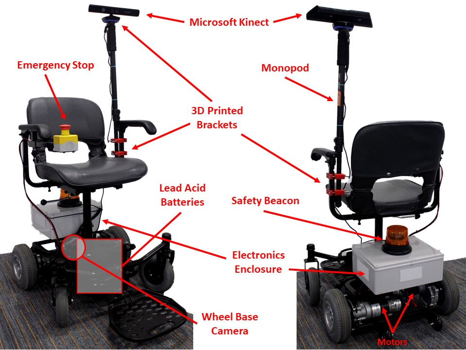

# QLAB | Autonomous Wheelchair

Arduino Mega and RPi based firmware and API for remote teleprescence operation of a mobility wheelchair.

## System

## Dependencies

For use the above dependencies and the follow are requird;

* Anaconda Python Platform (https://anaconda.com) with the following packages installed

* pip `pip install requests`
* pip `pip install pygame`
* pip `pip install cherrypy`
* pip `pip install pyserial`

### Hardware Dependencies
* Arduino MEGA 2560
* RaspberryPi 3
* Microsoft Kinect V1 (Note that the V2 Kinect Sensor requires USB 3.0 Support)
* Pololu G2 H-Bridge [Motor Driver](https://www.pololu.com/product/2995) (24v21)  

## Questions or Issues

Contact Ryan McCartney, `rmccartney856@gmail.com`, `https://twitter.com/Ryan_McCartney1`

## Copyright
This source code is copyright, All rights reserved, QLab 2019
